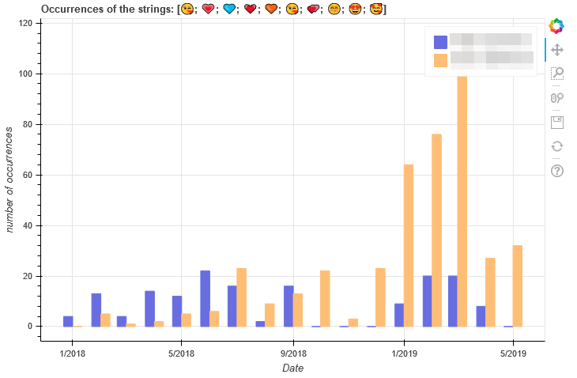
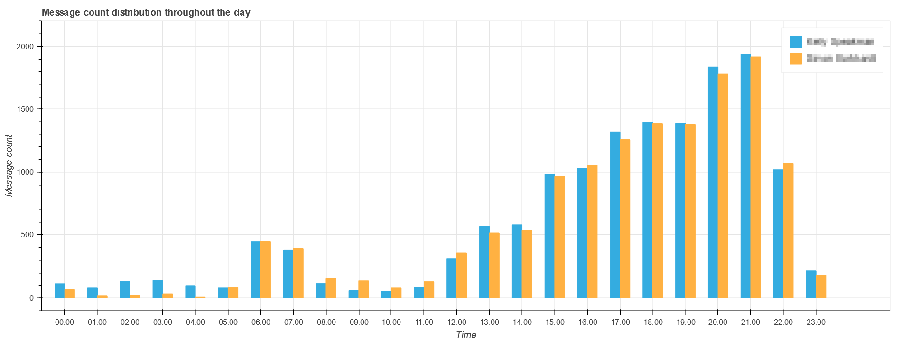
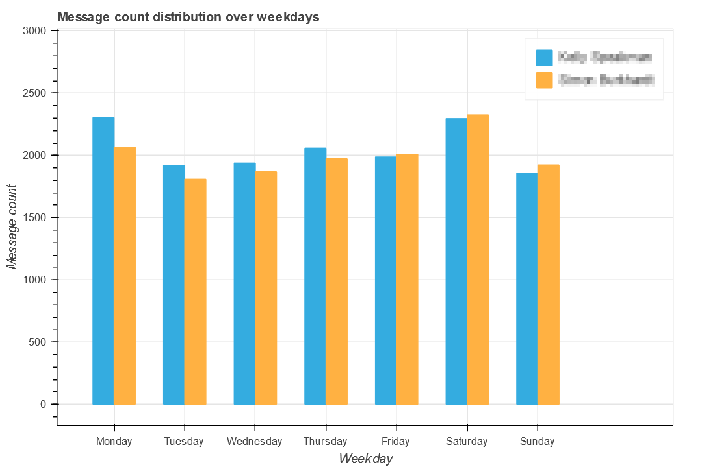

# Telegram Chat Statistics

---

[](https://www.python.org/)

[](https://github.com/auchenberg/volkswagen)

Generate graphs and statistics from your exported Telegram messages.

## Examples








---

## Usage

First you need to export your Telegram data to a `result.json` file. You can do this in the settings of the Telegram desktop client.

```bash
./telegram-statistics.py -i result.json -n "name"
```

Open the file `result_2019-05-30.json` and parse the chat history with `Name Surname` starting from `2018-01-01` up to now and generate the substring plot for the emojis "😘💗💙💓🧡😘💕😚😍🥰"

```bash
./telegram-statistics.py -i ../result_2019-05-30.json -n "Name Surname" -d 2018-01-01 -w "😘;💗;💙;💓;🧡;😘;💕;😚;😍;🥰"
```

### Import Whatsapp

There is a `convert-whatsapp.py` to import a whatsapp exported `Whatsapp Chat with Name.txt` into a Telegram style json format.
To find the correct `[Name Surname]` take the name in the first line in the Whatsapp export txt.
However, the Whatsapp export is not as detailed as the Telegram export, so many numbers cannot be calculated.

```bash
./convert-whatsapp.py -i "Whatsapp Chat with Name.txt"
./telegram-statistics -i whatsapp-result.json -n "Name Surname"
```

Where `"name"` is the name displayed in Telegram (usually the surname).

## Generated Files

The script generates multiple files.

- `emojis.txt` contains unicode encoded emojis and their count
- `raw_metrics.json` raw numerical data (contains all text of both persons / large file)

HTML Files (Plots):

- `plot_hours.html` bokeh plot of message frequency over the hours of one day
- `plot_month.html` bokeh plot of number of messages sent per month
- `plot_month_characters.html` bokeh plot of characters sent per month
- `plot_weekdays.html` bokeh plot of message frequency over one week
- `plot_month_calls.html` bokeh plot of number of calls per month 
- `plot_month_call_time.html` bokeh plot of total seconds on call per month
- `plot_month_photos.html` bokeh plot of number of photos sent per month 
- `plot_month_replytime.html` bokeh plot of average monthly replytime (Beta)
- `plot_month_word_occurrence.html` bokeh plot of combined substring occurences over time

Raw Files (one for each person):

- `raw_months_person_Person A.csv` csv vaues of month data
- `raw_weekdays_person_Person A.csv` csv vaues of weekday data
- `raw_months_chars_person_Person A.csv` csv vaues of monthly character count data
- `raw_monthly_pictures_person_Person A.csv` csv vaues of monthly picture count data
- `raw_monthly_calls_person_Person A.csv` csv vaues of monthly number of calls
- `raw_monthly_call_duration_person_Person A.csv` csv values of monthly call duration
- `raw_monthly_time_to_reply_person_Person A.csv` csv vaues of monthly reply time


## Metrics

### per chat
- total number of messages
- total number of words
- total number of characters
- count occurrence of each word
- number of unique words

### per person
- total number of messages
- total number of words
- total number of characters
- average number of words per message
- average number of characters per message
- count occurrence of each word
- count occurrence of each emoji
- number of messages formated with markdown
- number of messages of type [animation, audio_file, sticker, video_message, voice_message]
- number of photos
- number of unique words

## Requirements

- `python 3`
- `bokeh`
- `numpy`
- `pandas`

---

## Contributing

I was inspired to do this project by a post on [reddit.com/r/LongDistance](https://www.reddit.com/r/LongDistance/comments/9jud8j/analysis_of_texts_from_a_long_distance/)

I would love to hear if you have made some statistics yourself. Feel free to message me on [reddit](https://www.reddit.com/u/mnemocron)

If you want to implement new metrics feel free to fork and send a pull request.
Here are some things that I think could be improved or added:

- normalize weekly / hourly data to "average number" per day/hour instead of "total number"
- number of edited messages

#### Possible Issues

- csv separator is currently a semicolon `;`
- other country specific errors (eg. with dates)

---

## License

MIT License

Copyright (c) 2018 Simon Burkhardt

